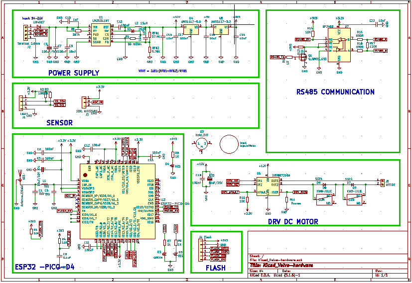
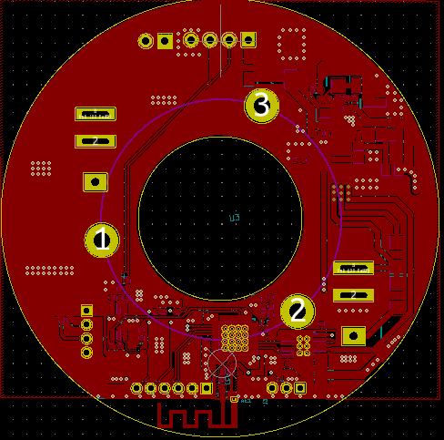
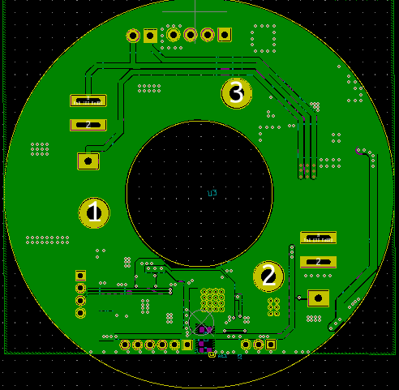
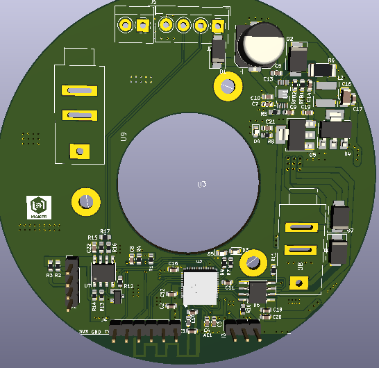
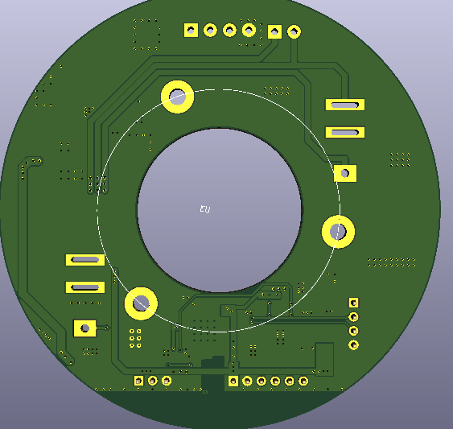

# PCB_SLAVE
# Kicad_Valve-hardware
# Hardware 

## Schematic

## PCB Layout
### Top side

### Back side

## 3D
### Top side
[]
### Back side
[]
## GERBER
- [Gerber_slave](./assets/gerber/slave.rar)

## REMARK

# LICENSE
